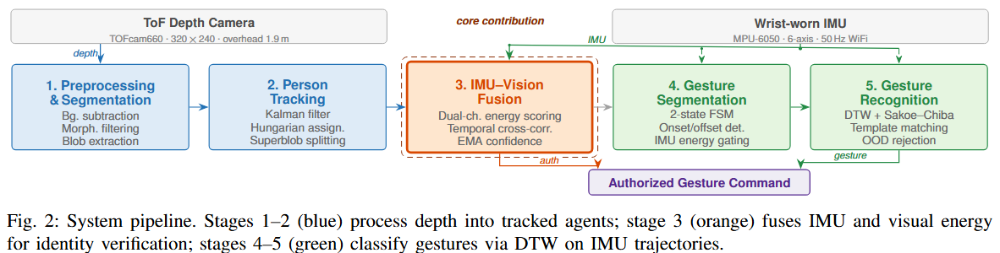
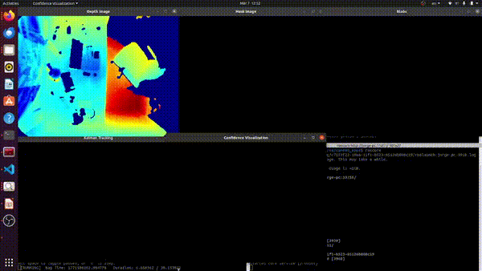
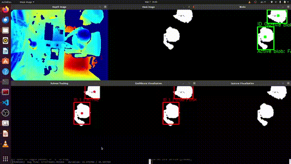

# Identity-verified Gesture Recognition based on Time-of-Flight Sensors

A ROS-based system for real-time person authorization and gesture recognition using the [Espros cam660](https://www.espros.com/photonics/tof-cameras/) time-of-flight (ToF) depth camera, with optional IMU-assisted gesture segmentation.

The system detects and tracks people in a scene, assigns a confidence-based authorization score to each tracked agent, and recognizes hand/arm gestures performed by the currently authorized person. It supports both single-agent and multi-agent scenarios.

---

## System Overview

  

        
     
Additionally, I metrics node, working as a passive subscriber, collects per agent-level stats and generate automatic reports on shutdown.


### Packages

| Package | Role |
|---|---|
| `tof_preprocessing` | Foreground segmentation, morphological filtering, connected-component blob detection, Kalman tracking, biometric-confidence fusion, authorized-agent publishing |
| `gesture` | IMU-based gesture onset/offset detection, DTW gesture recognition with Sakoe-Chiba band, template management |
| `mpu` | IMU driver and custom message types (`ConfArray`) |
| `metrics` | Metrics collection node, offline accuracy computation script |

---

## Dependencies

- ROS Noetic (Python 3)
- `numpy`, `scipy` (DTW distance)
- `cv2` (morphological operations)
- Espros cam660 ROS driver

---

## Build

```bash
cd ~/your_ws
catkin_make
source devel/setup.bash
```

---

## Usage

### Live system

```bash
# Single-agent
roslaunch tof_preprocessing system.launch bag_name:=my_recording

# Multi-agent (higher noise — increased median and opening kernels)
roslaunch tof_preprocessing system.launch \
    bag_name:=my_recording \
    fg_depth_thresh:=1600 \
    median_kernel:=5 \
    open_kernel_size:=5
```

### Bag playback (with metrics collection)

```bash
roslaunch tof_preprocessing system_rosbag.launch \
    bag_name:=single_001 \
    fg_depth_thresh:=1500 \
    open_kernel_size:=3
```

Key tunable parameters:

| Parameter | Default | Notes |
|---|---|---|
| `fg_depth_thresh` | 1500 | Max foreground depth (mm). Raise for far subjects or multi-agent. |
| `median_kernel` | 3 | Depth denoising kernel. Use 5 for multi-agent (more IR multi-path noise). |
| `open_kernel_size` | 3 | Morphological opening to remove noise blobs. Use 5 for multi-agent. |
| `close_kernel_size` | 17 | Morphological closing to fill gaps within blobs. |

> **Note on parameter tuning:** The cam660 exhibits thermal depth drift of 10–50 mm during operation. The `fg_depth_thresh` and `open_kernel_size` may need slight adjustment between recording sessions recorded several minutes apart. For multi-agent scenes, `median_kernel` and `open_kernel_size` generally need to be increased to suppress IR multi-path interference between subjects.

### Recording

```bash
# Single-agent
./record_sys.sh

# Multi-agent
./record_sys_multi.sh
```

### Gesture template management

```bash
# Record a new gesture template
roslaunch gesture record_gesture.launch record_gesture_name:=arm_up_down

# Launch gesture recognition only
roslaunch gesture gesture_recognition.launch

# Launch gesture recognition with identity verification
roslaunch gesture gesture.launch identity_verification:=true

# Offline test: evaluate all templates in a class against each other (leave-one-out)
python3 src/gesture/scripts/test.py circle
python3 src/gesture/scripts/test.py arm_up_down
python3 src/gesture/scripts/test.py ood

# Remove low-sample templates
python3 src/gesture/scripts/clean_templates.py [--threshold 30] [--dry-run]
```

### Metrics

After running one or more bags, compute accuracy against a ground truth file:

```bash
# Print to console
python src/metrics/scripts/compute_accuracy.py src/metrics/ground_truth/ground_truth.json

# Print and save
python src/metrics/scripts/compute_accuracy.py src/metrics/ground_truth/ground_truth.json \
    -o src/metrics/scripts/report.txt
```

Ground truth format (`ground_truth.json`):

```json
{
  "single_001": {
    "authorized_agents": [0],
    "expected_gestures": {
      "0": {"circle": 1, "arm_up_down": 1}
    }
  },
  "multi_001": {
    "authorized_agents": [0, 2],
    "expected_gestures": {
      "0": {"circle": 2},
      "2": {"arm_up_down": 1}
    }
  }
}
```

Per-bag result files (`.txt` and `.json`) are written to `src/metrics/results/` on node shutdown.

---

## Demo
### Single-agent


### Multi-agent


## Performance

Evaluated on 57 recorded bags (28 single-agent, 29 multi-agent) across 11 participants (5F/6M, heights 160–190 cm). Each bag contains one or more gesture attempts (circle or arm up-and-down) by the authorized person.

### Offline gesture recognition (leave-one-out, 11 participants)

| Class | Templates | Correct | Accuracy |
|---|---|---|---|
| Circle | 180 | 145 | 80.6% |
| Arm up-and-down | 193 | 165 | 85.5% |
| Out-of-distribution (rejection) | 121 | 120 | 99.2% |
| **Overall** | **494** | **430** | **87.0%** |

Micro F1 (gesture classes): **0.906** — Precision: 0.997, Recall: 0.831

### Online system (57 bags, ~40 minutes total scene time)

#### Single-agent (28 bags)

| Metric | Value |
|---|---|
| Authorization F1 | 0.951 |
| Authorization accuracy | 0.930 |
| Precision / Recall | 0.935 / 0.967 |
| Correct auth time | 99.7% |
| Scene auth coverage | 67.7% |
| Avg time to authorization | 3.03 s |
| Gesture precision | 1.000 |
| Gesture recall | 0.521 |
| Recognition latency (mean) | 2.85 s |

#### Multi-agent (29 bags)

| Metric | Value |
|---|---|
| Authorization F1 | 0.723 |
| Authorization accuracy | 0.733 |
| Precision / Recall | 0.600 / 0.911 |
| Correct auth time | 82.6% |
| Scene auth coverage | 71.9% |
| Avg time to authorization | 3.26 s |
| Gesture precision | 1.000 |
| Gesture recall | 0.487 |
| Gestures to GT agent | 92.1% |
| Recognition latency (mean) | 3.08 s |

#### Key observations

- **Gesture precision is perfect (1.000) in both scenarios** — the system never recognizes a gesture incorrectly. Recall is the limiting factor (gestures missed, not wrongly classified).
- **Single-agent authorization is highly reliable** — near-zero false positives, only 1 missed authorization across 28 bags.
- **Multi-agent authorization has more false positives** — when multiple people are present, non-authorized agents occasionally briefly exceed the confidence threshold. Correct authorization time remains at 82.6%, meaning FP windows are short time flickering before authorization returns to the right agent.
- **Gesture recall is limited by detection, not classification** — the main causes of missed gestures are: agent temporarily lost during segmentation, gesture performed before confidence has built up, or gestures executed back-to-back without sufficient rest time between them.
- **Recognition latency ~3 s** — inherent to the DTW sliding-window approach; the system needs to observe the full gesture trajectory before matching.
- **Stationary agents may be absorbed into the background** over time due to the adaptive background model (`bg_beta2`). Vigorous movement restores foreground detection.
